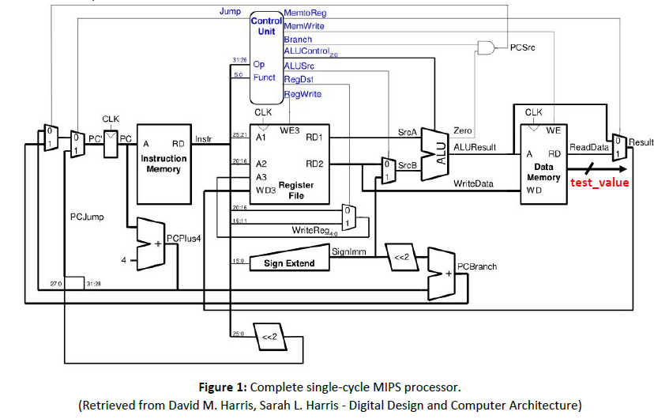
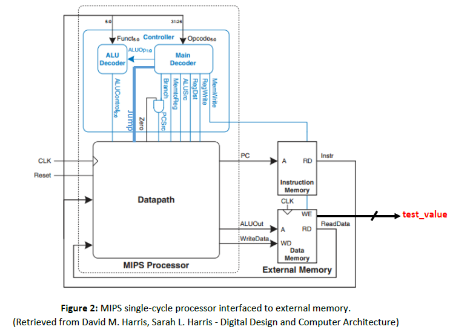
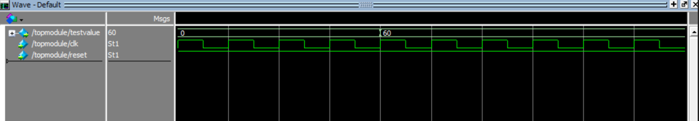
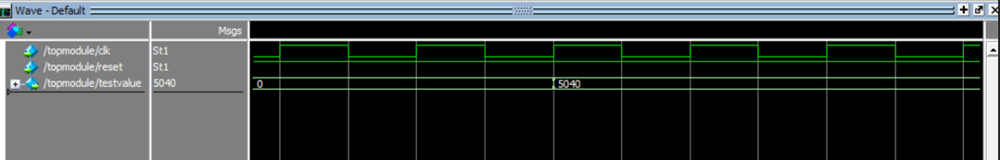

# Single Cycle MIPS Processor

### Introduction

A 32-bit single-cycle microarchitecture MIPS processor based on Harvard Architecture. The single-cycle microarchitecture executes an entire instruction in one cycle. In other words instruction fetch, instruction decode, execute, write back, and program counter update occurs within a single clock cycle.

### Top Module View

---

The processor is composed of a datapath and a controller. The controller, in turn, is composed of the main decoder and the ALU decoder. Figure 2 shows a block diagram of the single-cycle MIPS processor interfaced to external memories.

---
### Final Simulation Results

- #### Program 1: GCD of 120 and 180

- #### Program 2: Factorial Number of 7

